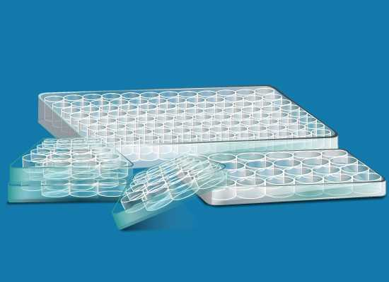

#### Materials Required:-
 
•	Specific antibody–alkaline phosphatase conjugate

•	Deionized water

•	Blocking buffer

•	Capture antibody solution

•	Test antigen samples

•	P-nitro phenyl phosphate (NPP) substrate solution

•	Stop solution (0.5 m NaOH)

•	96 - well microtiter plate

•	Microtiter plate reader - spectrophotometer with 405-nm filter

•	Pipette and disposable pipette tips

•	Plastic squirt bottles

•	Vials (1.5 ml)

•	Vial rack

•	Plastic wrap

•	Plastic container

•	Incubator

•	Absorbent paper

 &nbsp;
 
 

#### Buffers and Reagents: 
 

##### Bicarbonate/carbonate coating buffer (100 mM):

Antigen or antibody should be diluted in coating buffer to immobilize them to the wells:

3.03 g Na2CO3, 

6.0 g NaHCO3 

1000 ml distilled water

pH 9.6
 

 &nbsp;
 
 
##### PBS:
 

1.16 g Na2HPO4,

0.1 g KCl,

0.1 g K3PO4, 

4.0 g NaCl (500 ml distilled water) pH 7.4.

 &nbsp;
 
 
##### Blocking solution:
 

Commonly used blocking agents are 1% BSA , serum, non-fat dry milk, casein, gelatin in PBS.

 
 &nbsp;
 
##### Wash solution:
 
Usually PBS or Tris -buffered saline (pH 7.4) with detergent such as 0.05% (v/v) Tween20 (TBST).

 &nbsp;
 
 

##### Antibody dilution buffer:
 

Antibody should be diluted in 1x blocking solution to reduce Non specific binding.

 &nbsp;
 
##### Microplate
 

A microplate typically has  6, 12, 24, 96, 384  or even 1536 sample wells arranged in a 2:3 rectangular matrix. Elisas are typically performed in 96-well polystyrene plates, which will passively bind antibodies and proteins. Microplates are manufactured in a variety of materials and the most common is polystyrene. Polypropylene is used for the construction of plates subjected to wide changes in temperature, such as storage at 800C. Other materials which have been shown to be suitable carriers are particles of cellulose, polyacrylamide, cross linked dextrans and plastic.

&nbsp;

## Procedure
 
#### Coating antigen to microplate:
 
•	Dilute the antigen to a final concentration of 20 µg/ml in PBS or other carbonate buffer. Coat the wells of a PVC microtiter plate with the antigen by pipetting 50  µl  of the antigen dilution in the top wells of the plate.  Dilute down the plate as required. Ensure the samples contain the antigen at a concentration that is within the detection range of the antibody. 

•	Cover the plate with an adhesive plastic and incubate for 2 h at room temperature, or 4oC overnight. The coating incubation time may require some optimization. 

•	Remove the coating solution and wash the plate twice by filling the wells with 200 µl PBS. The solutions  or washes are removed by pipetting. The remaining drops are removed by patting the  plate on a paper towel.
 

#### Blocking:
 
•	Block the remaining protein-binding sites in the coated wells by adding 200 µl blocking buffer, 5% non fat  dry milk/PBS, per well.

•	Cover the plate with an adhesive plastic and incubate for at least 2 h at room temperature.( if more  convenient, overnight at 4°C).

•	 Wash the plate twice with 200 µl PBS.
 

#### Incubation with the Antibody:
 
•	Add 100 µl of the antibody, diluted at the optimal concentration (according to the manufacturer’s  instructions) in blocking buffer immediately before use.

•	 Cover the plate with an adhesive plastic and incubate for 2 h at room temperature.

•	 This incubation time may require optimization. Although 2 hours is usually enough to obtain a strong signal, if a   weak signal is obtained, stronger staining will often observed when incubated overnight at 4oC.

•	 Wash the plate four times with 200 µl PBS.
 

#### Detection:
 
•	Dispense 100 µl  of the substrate solution per well.

•	After sufficient color development (if it is necessary) add 100 µl of stop solution to the wells.

•	Read the absorbance (optical density) of each well with a plate reader.

Note: some enzyme substrates are considered hazardous (potential carcinogens), therefore always handle  with care and wear gloves.

#### Analysis of Data:
 
 Prepare a standard curve from the data produced from the serial dilutions with concentration on the x axis (log scale) vs absorbance on the Y axis (linear).  Interpolate the concentration of the sample from this standard curve.
 
 
#### Prepare a standard antigen-dilution:
Prepare six 1:3 serial dilutions of standard antigen solution in blocking buffer and  these antigen concentrations will be used in preparing a standard inhibition curve. For most protein antigens, initial concentration should be 10 μg/ml, followed by nine 1:4 serial dilutions in blocking buffer. These antigen dilutions are assayed for their ability to inhibit the binding of conjugate to antigen coated plates under standard assay conditions. From this initial assay, six 1:3 antigen dilutions spanning the dynamic range of inhibition are selected for further use as standard antigen -inhibitor dilutions. Prepare  ≥75 μl of each dilution for each plate to be assayed.
 
•	Place five 12 × 75–mm test tubes in a rack and add 3 ml blocking buffer to the last four tubes.

•	In tube 1, prepare a 4-ml solution of secondary reagent at 200 ng/ml in PBSN. Transfer 1 ml of tube 1 solution to tube 2. Pipette up and down five times.

•	Repeat this transfer and mix for tubes 3 to 5; the tubes now contain the secondary reactant at 200, 50, 12.5, 3.125, and 0.78 ng/ml
 
#### Prepare dilutions of test antigen solutions in blocking buffer:

It may be necessary to assay one or two serial dilutions of the initial antigen test solution to ensure that at least one of the dilutions can be accurately measured. For most assay systems, test solutions containing 1 to 100 ng/ml of antigen can be accurately measured.
 
#### Prepare developing-reagent dilutions (antibody–alkaline phosphatase conjugates):
 
•	Place five 17 × 100–mm test tubes in a rack and add 3 ml blocking buffer to the last four tubes.

•	In tube 1, prepare a 6-ml solution of developing reagent at 500 ng/ml in blocking buffer.

•	Transfer 3 ml of tube 1 solution into tube 2 and mix.

•	Repeat this transfer and mixing for tubes 3 and 4—the tubes now contain the developing reagent at 500, 250, 125, 62.5, and 31.25 ng/ml.
 
 
#### Prepare coating-reagent dilutions by diluting specific antibody in PBSN:
 
•	Place four 17 × 100–mm test tubes in a rack and add 6 ml PBSN to the last three tubes.

•	In tube prepare a 12-ml solution of coating reagent at 10 μg/ml in PBSN.

•	Transfer 6 ml of tube 1 solution to tube 2. Mix by pipetting up and down five times.

•	Repeat this transfer and mix for tubes 3 and 4; the tubes now contain the coating reagent at 10, 5, 2.5, and 1.25 μg/ml.
  
•	Mix and incubate conjugate and inhibitor by adding 75 μl  of   conjugate solution to each well of a round- or cone-bottom  microtiter plate, followed by 75 μl  inhibitor—either test antigen solution.mix the conjugate and inhibitor solutions by pipetting up and down in the pipette tip three times and incubate 30 min at room temperature.

•	Prepare uninhibited control samples by mixing equal volumes of conjugate solution and blocking buffer.

•	Prepare a standard curve constructed from the data produced by serial dilutions of the standard antigen. Plot antigen concentration on the x axis which is a log scale, and absorbance on the y axis which is a linear scale. Interpolate the concentration of antigen in the test solutions from the standard curve.
 
### Advantages:
 
•	Quick because only one antibody and fewer steps are used.

•	Cross-reactivity of secondary antibody is eliminated.
 
### Disadvantages:
 
•	Immunoreactivity of the primary antibody might be adversely affected by labeling with enzymes or tags.

•	Labeling primary antibodies for each specific ELISA system is time-consuming and expensive.

•	No flexibility in choice of primary antibody label from one experiment to another.

•	Minimal signal amplification.

