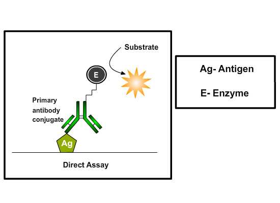

### Principle:
 

In 1971, after the descriptions of Peter Perlmann and Eva Engvall at Stockholm University in Sweden, Elisa has become the system of choice when  assaying  soluble  antigens  and antibodies. All assays for antibody production depend upon the measurement of interaction of elicited antibody with antigen. Elisa has been used as a tool for disease diagnosis to evaluate either the presence of antigen or the presence of antibody in serum sample,  for e.g. screening donated  blood for evidence of viral contamination by  HIV-1 and HIV-2, Hepatitis C, Hepatitis B, Human T Cell Lymphotropic Virus Type 1 and 2 , detecting infections of sexually-transmitted agents like syphilis and Chlamydia, detecting allergens in food, measuring "rheumatoid factors" and other auto antibodies in autoimmune diseases like lupus erythematosus, measuring hormone levels, HCG (determining the time of ovulation) ,TSH, T3 and T4 (for thyroid function). 
         

 

This assay is used to detect or quantitate soluble antigens and is most useful when both a specific antibody and milligram quantities of purified or semi-purified antigen are available. To detect soluble antigens, plates are coated with antigen and the binding of specific antibody-enzyme conjugates to antigen-coated plates is inhibited by test solutions containing soluble antigen. The direct assay may also be adapted as an indirect assay by substituting specific antibody for specific antibody-enzyme conjugate. The amount of specific antibody bound is then detected using a species-specific or isotype-specific conjugate as a tertiary reactant. The assay seems to be quick because only one antibody and fewer steps are used and cross-reactivity of secondary antibody is eliminated. Immunoreactivity of the primary antibody might be adversely affected by labeling with enzymes or tags and labeling primary antibodies for each specific Elisa system is time consuming and expensive.

### Different Stages Of Direct Competitive  ELISA:
 

#### Coating ELISA Plates:
 

Coating is achieved through passive adsorption of the antigen to the assay microplate. This process occurs through hydrophobic interactions between the microtiter plate and non-polar protein residues. Although individual proteins may require specific conditions or pretreatment for optimal binding, the most common method for coating plates involves adding a 2-10 μg/ml solution of protein dissolved in an alkaline buffer such as phosphate-buffered saline (pH 7.4) or carbonate-bicarbonate buffer (pH 9.4). The buffer contains no other proteins that might compete with the target antigen for attachment to the microtiter plate. Antigens which are protein in nature will attach passively to the microtiter well plate during incubation at 370C

 

#### Washing step:
 

After incubation, excess antigens are removed by washing steps by flooding and emptying the wells with neutral phosphate buffered saline (PBS) or deionized water. Washing steps are necessary to remove unbound reagents and to decrease background, thereby increasing the signal-to-noise ratio. Insufficient washing will allow high background, while excessive washing might result in decreased sensitivity caused by elution of antigen from the wells.

 

#### Adding blocking buffer:
 

The binding capacity of microplate wells is typically higher than the amount of protein coated in each well and the  residual binding capacity of the plate is blocked in this step. The ideal blocking buffer will bind to all potential sites of nonspecific interaction, eliminating background altogether, without altering or obscuring the epitope for antibody binding. The blocking buffer is effective if it improves the sensitivity of an assay by reducing background signal and improving the signal-to-noise ratio. Tween 20 (0.05%) by itself is more effective in blocking than any other protein tested, but because the combination of protein and Tween 20 may be more effective  than Tween 20 alone  in some cases, bovine serum albumin (BSA; 0.25%) is included in the blocking buffer. Coated plates can be used immediately or dried and stored at 4°C for later use, depending on the stability of the coated protein.

 

Incubation with mixtures of the conjugate and test antigen solution: The binding of specific antibody-enzyme conjugates to antigen-coated plates is inhibited by test solutions containing soluble antigen.

 

##### Washing step:
 

After incubation with mixtures of the conjugate and inhibitor in antigen-coated wells, unbound conjugate is washed away.

 

##### Adding substrate:
 

Substrates are critical for the detection and visualization steps of an ELISA. The step involves the addition of suitable substrate solution for the particular enzyme conjugated to the antibodies. The objective is to allow development of color reaction  through enzyme catalysis. A large selection of substrates are available for performing the ELISA with an HRP or AP conjugate.TMB (3, 3’, 5, 5’-tetramethyl benzidine) is the most commonly used substrate for the enzyme horseradish peroxidase (HRP). The  substrates  of  alkaline  phosphatase (AP), 4-methylumbelliferyl phosphate  (MUP)  and  PNPP (p-nitro phenyl-phosphate)  are  nontoxic and  relatively  stable.  Solutions  of  p-nitro-phenyl phosphate (NPP) are stable for months at 4°C, while solutions of 4-methylumbelliferyl phosphate  (MUP)  can  be  kept  for months  at room  temperature  without  any  significant spontaneous hydrolysis. The biggest disadvantage if NPP  is used  as  a  substrate is that,  the  yellow  color  of  the nitro phenyl  product  is  relatively  difficult  to detect  visually. Using  the  substrate MUP  instead of NPP can greatly enhance the sensitivity of  the  assay.  The  fluorogenic  system  using MUP is 10 to 100 times faster than the chromogenic system using NPP, and appears to be as sensitive as an enhanced chromogenic assay in which  alkaline  phosphatase  generates NAD+ from NADP. The disadvantage of using fluorogenic substrates is that they require a microplate fluorometer costing twice as much as a high quality microtiter plate spectrophotometer.

 

The amount of antigen in the test solutions is proportional to the inhibition of substrate hydrolysis and can be quantitated by interpolation onto an inhibition curve generated with serial dilutions.

 

### Quantification:
 

Specially designed spectrophotometers are available which read through the microtiter wells either singly or in rows. Several ELISA plate readers are available, with increasing levels of sophistication. Some of these provide a measurement of optical density while some tabulate data and apply statistical analysis. Compatibility with a small computer, and availability of a suitable program to process the results and transform the optical density readings into concentrations of protein are important additional things to look for when selecting an instrument. Most ELISA readers can be set to measure the absorbance of the colors produced by the action of antibody- conjugated enzymes on their respective substrates.The microplate reader works by shining a particular type of  light at each of the samples in the micro well plate. Common detection modes for microplate assays are absorbance, fluorescence intensity, luminescence, time and fluorescence polarization. A light source illuminates the sample using a specific wavelength (selected by an optical filter, or a monochromator), and a light detector located on the other side of the well measures how much of the initial (100%) light is transmitted through the sample, the amount of transmitted light will typically be related to the concentration of the molecule of interest. This is called absorption detection. The range of application of fluorescence intensity  detection is much broader than when using absorbance detection, but instrumentation is usually more expensive.  Microplate readers feed the absorbance or fluorescence measures into a computer program that analyses the particular information being collected. 

 

### Assay optimization:
 

Serial dilution titration analyses are performed to determine optimal concentrations of reagents to be used in Elisa’s. All three reactants in ELISA, a solid-phase coating reagent, a secondary reagent that binds the primary reagent, and an enzyme-conjugated tertiary developing reagent that binds to the secondary reagent are serially diluted and analyzed by a criss-cross matrix analysis. Once the optimal concentrations of reagents to be used under particular assay conditions are determined, these variables are kept constant from experiment to experiment

 

### Assay validation:
 

ELISA kits that are commercially available which are used for diagnostic purposes in  the detection of specific antigen or antibody in the serum sample. For e.g., ovarian cancer antigen (ca-125) enzyme immunoassay test  kit  is intended for use as a monitoring and screening test for  serum ca-125 level. An elevated serum ca-125 level can indicate ovarian cancer and suggests the need for further clinical management, also determining  serum ca-125 concentration may be useful in monitoring patients with diagnosed ovarian cancer.
Materials provided with the test kits includes antibody coated microtiter plate with 96 wells, enzyme conjugate reagent, substrate solution, stop solution, wash buffer concentrate, sample diluents, reference standards, positive and negative controls.
 

 

ELISA results are reported as a number and the most controversial aspect of this test is determining the "cut-off" point between a positive and negative result. A cut-off point may be determined by comparing  the ELISA plate  reader value with a known reference standard.  If an Elisa test is used for drug screening at workplace, a cut-off concentration, 50 ng/ml, for example, is established, and a sample will be prepared which contains the standard concentration of analyte. Unknowns that generate a signal that is stronger than the known sample are "positive" and those that generate weaker signal are "negative."
